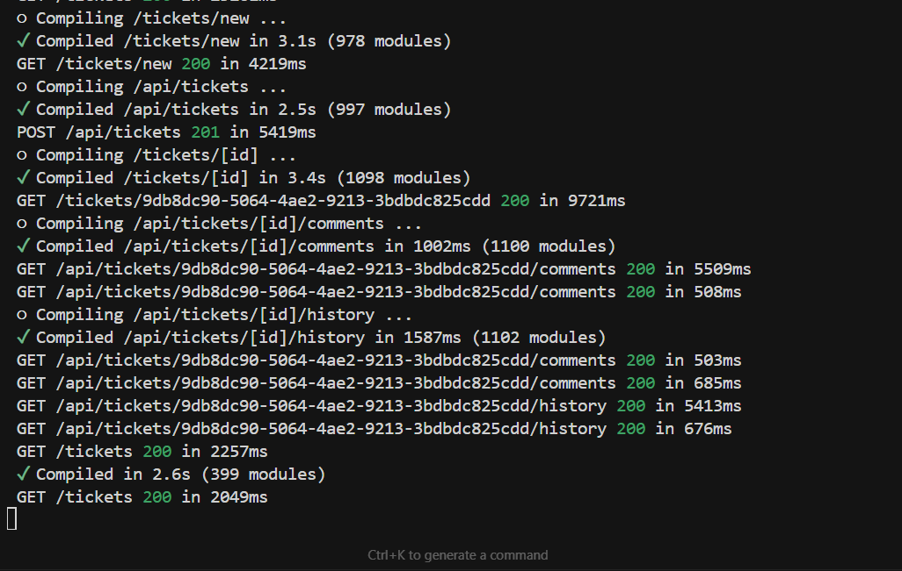

# HelpDesk System

A modern, cyberpunk-inspired Help Desk platform built with Next.js, TypeScript, Tailwind CSS, and Supabase. Includes AI-friendly UX, real-time SLA monitoring, rich ticket management, and a terminal-themed landing experience.

## Features
- AI-powered ticket routing and automation
- Real-time SLA monitoring and breach detection
- Ticket creation, details, comments, history timeline
- Filters, pagination, and dashboard views
- Terminal-style hero and ASCII feature grid
- Supabase-backed auth and data access

## Tech Stack
- Next.js (App Router)
- TypeScript
- Tailwind CSS
- Supabase (client and server SDKs)
- Lucide React icons

## Getting Started

### Prerequisites
- Node.js 18+
- pnpm or npm
- Supabase project and keys

### Environment Variables
Create a `.env.local` in the project root:

```bash
# Supabase client keys (browser + server)
NEXT_PUBLIC_SUPABASE_URL=your_supabase_url
NEXT_PUBLIC_SUPABASE_ANON_KEY=your_supabase_anon_key

# Optional: used only in server-side scripts (NOT used by app code)
SUPABASE_SERVICE_ROLE_KEY=your_service_role_key
```

### Install and Run
```bash
# install
pnpm install

# dev
pnpm dev

# build
pnpm build
pnpm start
```


## Pages and Screenshots
Add screenshots to `public/` and update the paths below. Suggested naming: `screenshot-*.png`.

### Landing (terminal-style)
File: `app/page.tsx`
- Terminal header: `helpdesk@terminal:~$`
- Commands demo: `cat welcome.txt`, `./features --list`, `./launch --interactive`
- ASCII “HELP DESK SYSTEM FEATURES” grid

Screenshot placeholder:
```text
public/screenshot-landing.png
```

### Tickets Dashboard
File: `app/tickets/page.tsx`
- List with filters, pagination, and cards

Screenshot placeholder:
```text
public/screenshot-tickets.png
```

### New Ticket
File: `app/tickets/new/page.tsx`
- Form to create a ticket

Screenshot placeholder:
```text
public/screenshot-new-ticket.png
```

### Ticket Details
File: `app/tickets/[id]/page.tsx`
- Details panel, comments, timeline/history

Screenshot placeholder:
```text
public/screenshot-ticket-details.png
```

## Terminal View (Hero) Screenshot
From `app/page.tsx`, capture the terminal content area showing:
- `helpdesk@terminal:~$`
- `cat welcome.txt` output
- `./features --list` output
- `./launch --interactive` call and action buttons

Terminal screenshot path:
```text
public/Screenshot 2025-10-04 200228.png
```

Embed example:
```markdown

```

## API Routes
- `GET /api/sla/stats` — SLA statistics
- `POST /api/sla/check-breaches` — Recalculate/scan breaches
- `GET /api/tickets` — List tickets
- `POST /api/tickets` — Create ticket
- `GET /api/tickets/[id]` — Get ticket
- `GET /api/tickets/[id]/comments` — List comments
- `POST /api/tickets/[id]/comments` — Add comment
- `GET /api/tickets/[id]/history` — Ticket history

Implementation is in `app/api/...`.


## Development Notes
- UI components live under `components/` with a `ui/` subfolder for primitives
- Supabase client helpers in `lib/supabase`
- Types and utilities in `lib/types.ts` and `lib/utils.ts`

## Screenshots: How To Capture
1. Run `pnpm dev` and navigate to each page.
2. Use your OS screenshot tool to capture the full viewport for each page.
3. Save images in `public/` using the placeholders above.
4. Update this README to link images using markdown:

```markdown


```


